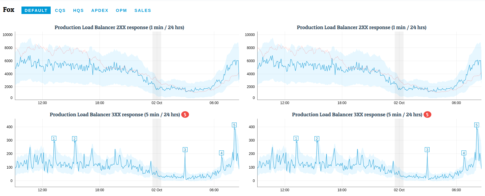

# Fox

[](https://github.com/prettier/prettier)

Real-time anomaly detection application, from multiple sources.



## Getting Started

```sh
docker build . -t fox
docker run --rm -d -p 127.0.0.1:8082:8080 fox
open http://127.0.0.1:8082/
```
> Note: Can run `make` too.

This will load the default config file at [config/default.json](config/default.json). If you have an `ENV` environment variable, this will be used instead.

```sh
docker run --rm -d -p 127.0.0.1:8082:8080 --env ENV=production fox
```
> Loads `config/production.json`.

Read [customisation.md](customisation.md) to learn how to create your own components: data intervals, detections
and notifications.

## Roadmap

- [ ] ability to load third party modules
- [ ] temporary disable alarms by api
- [ ] documentation
- [ ] remove hardcoded utcOffset
- [ ] more tests
- [x] complex notifications (if 5 events across all the metrics were found in the last 5 minutes then send a notification)
- [ ] multidimensional new relic data, data without facet

## Configuration

Use `config` environment variable to pass a path to configuration JSON file, for example:

### General

| Property               | Type   | Description                                                                                 |
|------------------------|--------|---------------------------------------------------------------------------------------------|
| server                 | Object | Configuration for the Restify server, properties: Number port, String host                   |
| logs                   | Object | Configuration for logger, properties: String level                                          |
| baseUrl                | String | Base URL that will be used in notifications as a back link to Web UI                        |
| schedulerNotifications | Object | Configuration object for Scheduler level notifications. Required field is 'name' that defines notification class name. Other parameters are depends on notification |

Example

```
{
     "server": {
          "port": 8080,
          "host": "0.0.0.0"
     },
     "logs": {
          "level": "debug",
          "json": true
     },
     "baseUrl": "http://192.168.1.1:8080/#/",
	 "schedulerNotifications": {
		  "name": "SESNotification",
		  ...
	 }
}
```

### Datasources

Datasources may have their own configuration defined in `dataSources` section.
Their parameters will be passed to a datasource constructor right after application is loaded.
Read about parameters needed for each datasource in datasource documentation.

For example `NewRelic` datasource requires `accountId` and `apiKey` as configuration parameters:

```json
{
    "dataSources": {
        "NewRelicInsights": {
            "accountId": 100000,
            "apiKey": "MySecretKey"
        }
    }
}
```

### Notifications

Notifications like datasources may have their own configuration but defined in `notifications` section.
Read about individual notification settings in their own documentation.

Example `SESNotification` requires AWS credentials and some email attributes:

```json
{
    "notifications": {
        "SESNotification": {
            "accessKeyId": "MYSECRETACCESSKEYIDFROMAWS",
            "secretAccessKey": "0000000000SECRET/ACCESSKEY00000000000000000",
            "to": ["user@email.com"],
            "from": "'Fox' <test@email.com>"
        }
    }
}
```

### Metrics

Metrics are defined in configuration file in `metric` section. Every metric must contain these params:

| Property          | Required | Type   | Description                                                                             |
|-------------------|----------|--------|-----------------------------------------------------------------------------------------|
| description       |          | String | Description for metric. Will be displayed as a header for metric's graph                |
| dataSource        | yes      | String | Name of the class that will be used as a data source for metric                         |
| dataSourceQueries | yes      | Object | Object that will be passed to data source class                                         |
| detection         | yes      | String | Name of the class + method that will be used as a detection function divided by dot (.) |
| detectionParams   |          | Object | Object that will be passed to detection class                                           |
| updateInterval    |          | Number | Time in ms to update metric (will be set to 5 minutes if not defined)                   |
| notification      |          | String | Notification resource name (must be defined in `notifications` config section). Will be randomly picked from the list of available notifications if value is not defined          |
| notificationConfig| no       | Object | Notification config object outlining some more details around notifications |
| style             |          | Object | Style object to assign to the chart container                                           |

Read particular data source or detection configuration to see the list of parameters you have to pass into them

Example:

```json
{
	"metrics": {
		"MetricCodeName": {
			"description": "Speed The Collapse",
			"dataSource": "NewRelicInsights",
			"dataSourceQueries": [
				"ALL(the, way) FROM WHERE we came BUILD a MANSION in a day"
			],
			"detection": "SimpleDetection.isNeighbourHouseCollapsed",
			"detectionParams": {
				"emaInterval": 6
			},
			"notification": "SESNotification",
			"notificationConfig": {
				"intervalSeconds": 600,
				"count": 5
			},
			"updateInterval": 900000,
			"style": {
				"width": "50%"
			}
		}
	}
}
```

## Development

1. Install dependencies
```sh
yarn
```

2. Start SPA
```sh
yarn start
```

3. Start Api
```sh
node server.js
```

## Contributing

Read [contributing.md](contributing.md) to learn more about contributing to this project.
